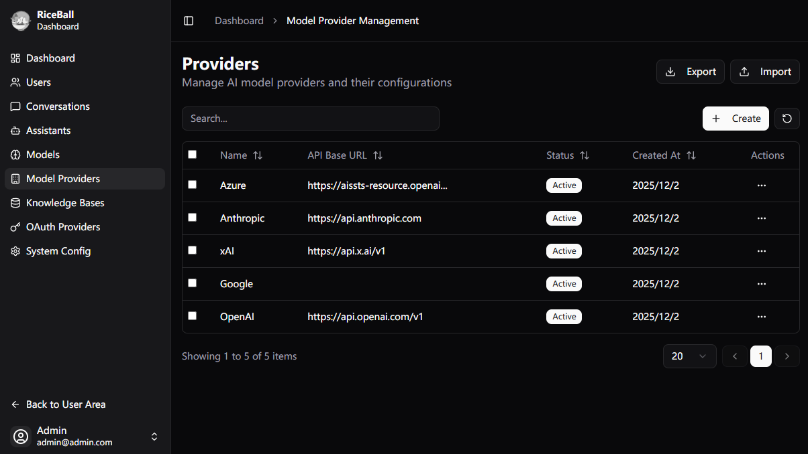

# RiceBall - Private AI Knowledge Base & Agent Platform Built for Teams and Enterprises

[中文文档](./docs/README.zh.md)

## 🍚 What is RiceBall?

RiceBall is an open-source, full-stack **AI Agent & Knowledge Base Platform**. It aims to help teams and enterprises quickly build and deploy LLM-based intelligent applications in a private environment.




**Core Capabilities:**

- **Private RAG Knowledge Base**: Supports document upload, automatic chunking, and vectorization, enabling AI to answer questions based on your private data.
- **Agent Engine**: Based on LangChain, supports tool calling and **MCP (Model Context Protocol)** (🚧 In Progress), empowering AI to execute tasks.
- **Multi-Model Aggregation**: Supports mainstream interface protocols like OpenAI and Anthropic, avoiding vendor lock-in.
- **Modern Full-Stack Architecture**: Backend uses FastAPI (Python), frontend uses Nuxt 3 (Vue), with built-in OAuth authentication.

## 💡 Why Choose RiceBall?

In the process of AI adoption, enterprises often face the dilemma of balancing data security and flexibility. RiceBall provides best practices:

1. **Complete Data Control**: Supports local deployment (Docker); all data (knowledge base, chat history) is stored on your private server.
2. **Deep Business Integration**: Through tool calling and the MCP protocol (🚧 In Progress), RiceBall can connect to your databases, APIs, and internal tools, becoming a true business assistant.
3. **Flexible Model Strategy**: Choose models based on scenarios—use high-performance models for complex reasoning, and cost-effective models for daily conversation to optimize costs.
4. **Developer Friendly**: Provides a clear modular architecture and comprehensive APIs, facilitating secondary development and customization.

## 👥 Target Audience

- **Enterprises & Teams**: Building internal knowledge base assistants, intelligent customer service, and R&D efficiency tools.
- **Full-Stack Developers**: Developers looking for a mature RAG + Agent architecture as a starting point.
- **System Integrators**: Service providers delivering private AI solutions to clients.

## 🐹 About the Name

The name RiceBall comes from a hamster I own. Every time it eats in its little food bowl, it curls up like a rice ball, so I named it RiceBall.

## 🚀 Quick Start

```bash
git clone ...

cp backend/.env.example backend/.env

docker-compose up -d
```

## ❤️ Acknowledgements

RiceBall wouldn't exist without the contributions of the open-source community. Special thanks to the following excellent open-source projects:

- [FastAPI](https://fastapi.tiangolo.com/)
- [FastAPI Users](https://frankie567.github.io/fastapi-users/)
- [Nuxt](https://nuxt.com/)
- [LangChain](https://www.langchain.com/)
- [ChromaDB](https://www.trychroma.com/)
- [Shadcn Vue](https://www.shadcn-vue.com/)
- ...

## 📄 License

This project is open source under the [MIT License](LICENSE).
