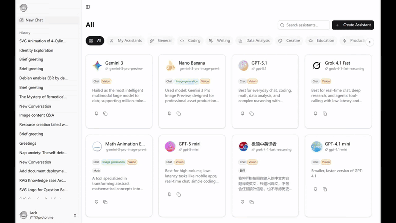
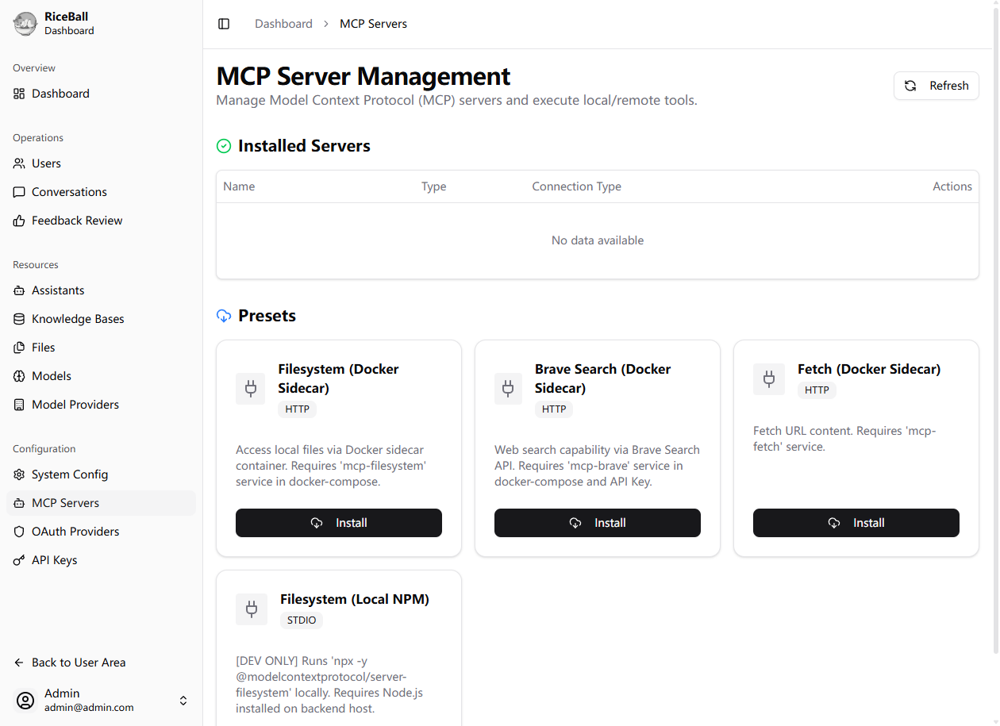
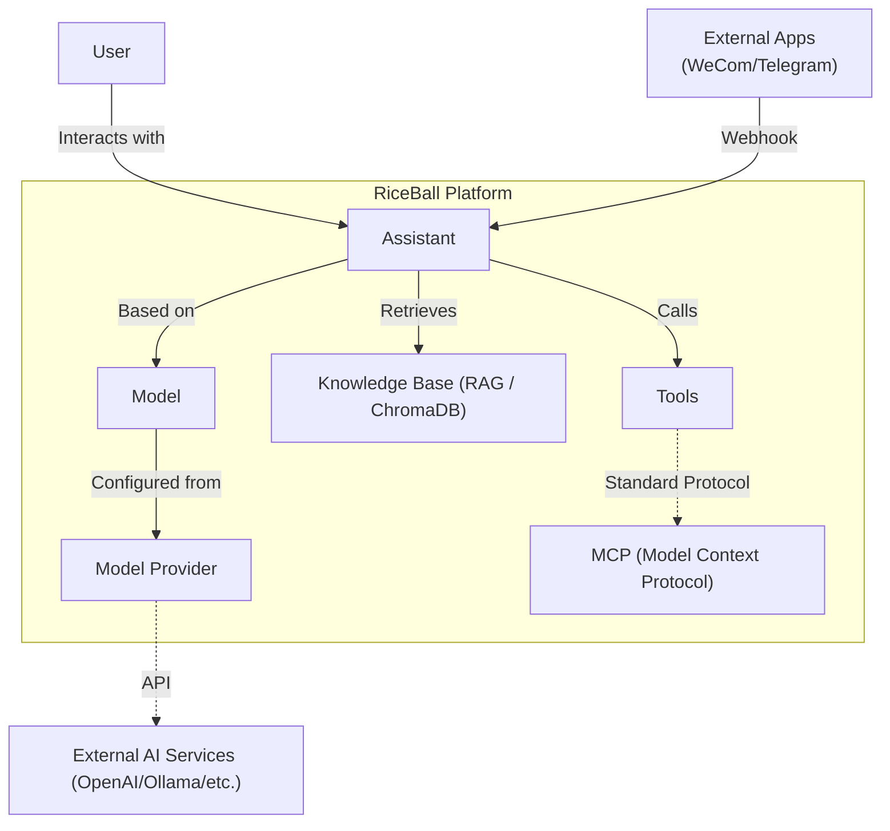

# RiceBall

[Documentation](https://riceball-ai.github.io/riceball/) | [文档](https://riceball-ai.github.io/riceball/zh/guide/intro.html)

An open-source, full-stack **AI Agent & Knowledge Base Platform**. It empowers teams to secure their data while leveraging cutting-edge AI capabilities through a private, customizable environment.




## 🧩 Concepts & Architecture



## ✨ Core Capabilities

- **🔐 Private RAG Knowledge Base**: 
  - Upload documents (PDF, DOCX, XLSX, PPTX, Markdown) securely.
  - **Web Reader**: Extract clean content from any webpage URL to your knowledge base.
  - Automatic chunking and vectorization using **ChromaDB**.
  - Citations and reference tracking.
- **🤖 Agent Engine**: 
  - Built on **LangChain**, utilizing robust **Tool Calling** capabilities to execute tasks.
  - **Universal MCP Support**: Full implementation of Model Context Protocol (MCP).
    - **Stdio**: Connect to local tools via standard input/output.
    - **HTTP (SSE)**: Uses HTTP POST for client-to-server messages with optional Server-Sent Events, enabling remote or Dockerized MCP server connections.
    - **Presets**: One-click install for common tools like Filesystem, Brave Search, etc.
- **📢 Multi-Channel Integrations**:
  - **Omnichannel**: Deploy your Assistant to **WeCom (Enterprise WeChat)**, **Telegram**, and more. 
  - **Guest Management**: Automatically maps external user identities to internal "Guest" accounts with isolated conversation history.
  - **Streaming**: Supports streaming responses even on platforms that require polling (like WeCom Smart Bot) via an intermediate stream buffer.
- **🔌 Multi-Model Support**: 
  - **Vendor Agnostic**: Support OpenAI, Anthropic, Google Gemini, XAI (Grok), etc.
  - **Ollama Integration**: One-click scan & import for local LLMs (DeepSeek, Llama3).
  - **Cost Optimization**: Route simple queries to cheaper models and complex reasoning to high-performance models.
- **🛡️ Enterprise SSO & Auth**:
  - Full **OAuth 2.0** support (Google, GitHub, Keycloak, Auth0).
  - Native integration with **WeCom (Enterprise WeChat)** for seamless employee login.
- **🚀 OpenAI Compatible API**: 
  - Expose your configured Assistant as a standard OpenAI API endpoint.
  - Integrate easily with existing tools like VS Code extensions or third-party wrappers.

## 🛠️ Tech Stack

- **Frontend**: [Nuxt 4](https://nuxt.com/) (Vue 3), [Shadcn Vue](https://www.shadcn-vue.com/), [TailwindCSS v4](https://tailwindcss.com/), [Pinia](https://pinia.vuejs.org/)
- **Backend**: [FastAPI](https://fastapi.tiangolo.com/), [SQLAlchemy](https://www.sqlalchemy.org/) (Async), [Alembic](https://alembic.sqlalchemy.org/)
- **AI & Data**: [LangChain](https://www.langchain.com/), [ChromaDB](https://www.trychroma.com/), [Pydantic](https://docs.pydantic.dev/)
- **Storage**: PostgreSQL / SQLite, Redis, S3 (MinIO/AWS)

## 💡 Why Choose RiceBall?

1. **Security First**: Self-hosted solution ensures your IP and user data remain on your infrastructure.
2. **Business Native**: Through **Tool Calling** and **Universal MCP Support**, RiceBall isn't just a chatbot—it's an operator that can interact with your business systems (Filesystem, Databases, APIs) regardless of where they are hosted.
3. **Developer Ready**: Clean, modular architecture (Frontend/Backend separation) makes it an excellent starter kit for custom AI solutions.

## 👥 Target Audience

- **Enterprises**: Private knowledge assistants and internal tooling.
- **Developers**: A robust, modern foundation for RAG/Agent applications.
- **Integrators**: Deploy tailored AI solutions for clients.

## 🐹 About the Name

The name RiceBall comes from a hamster I own. Every time it eats in its little food bowl, it curls up like a rice ball, so I named it RiceBall.

## 🚀 Quick Start

> **Note**: This setup is for **preview and testing purposes only**. Please use with caution in production environments.

Run RiceBall with a single command using our All-in-One Docker image (includes SQLite & Local Storage):

```bash
docker run -d \
  -p 8000:8000 \
  -e SUPERUSER_EMAIL=admin@admin.com \
  -e SUPERUSER_PASSWORD=admin123456 \
  -v riceball_storage:/app/storage \
  --name riceball \
  ghcr.io/riceball-ai/riceball:all-in-one-latest
```

Visit http://localhost:8000 to start using RiceBall. You can configure the initial superuser credentials via the `SUPERUSER_EMAIL` and `SUPERUSER_PASSWORD` environment variables.

## 🛠️ Production Deployment (Source Code)

For production environments requiring PostgreSQL and S3, you can deploy from source:

```bash
git clone https://github.com/riceball-ai/riceball.git
cd riceball

docker compose -f docker-compose.prod.yml up -d

```

## ❤️ Acknowledgements

RiceBall wouldn't exist without the contributions of the open-source community. Special thanks to the following excellent open-source projects:

- [FastAPI](https://fastapi.tiangolo.com/)
- [FastAPI Users](https://frankie567.github.io/fastapi-users/)
- [Vue.js](https://vuejs.org/)
- [Nuxt](https://nuxt.com/)
- [LangChain](https://www.langchain.com/)
- [ChromaDB](https://www.trychroma.com/)
- [Shadcn Vue](https://www.shadcn-vue.com/)
- ...

It is impossible to list all projects. If your project is used but not listed here, please contact us to add it.

## 📄 License

This project is open source under the [MIT License](LICENSE).
