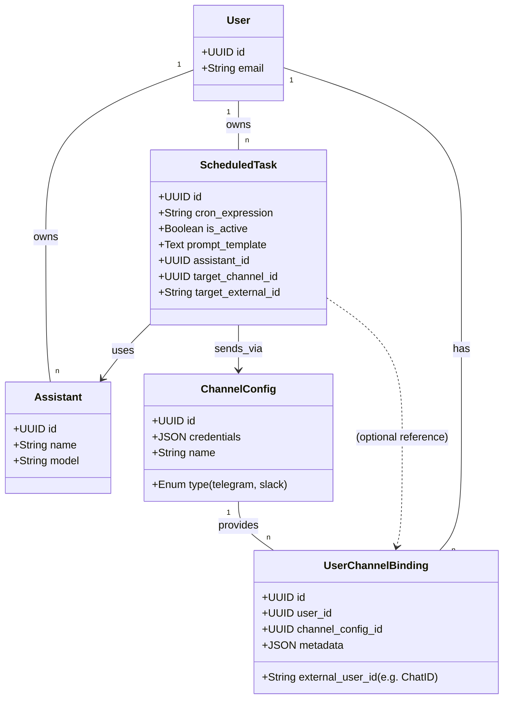
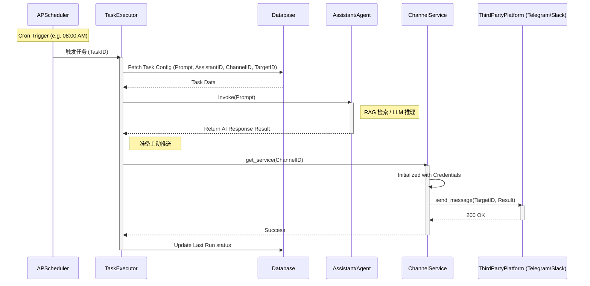
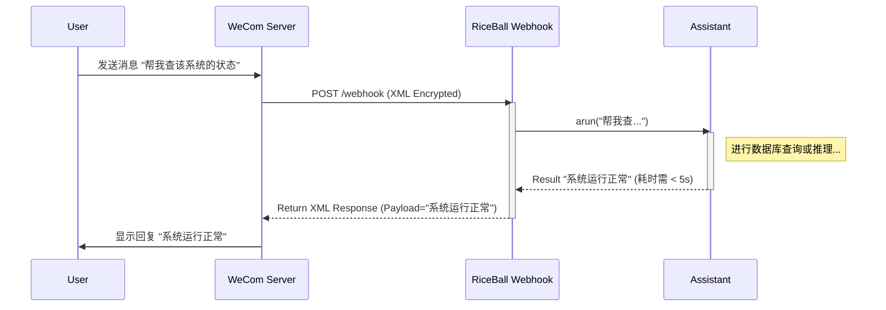
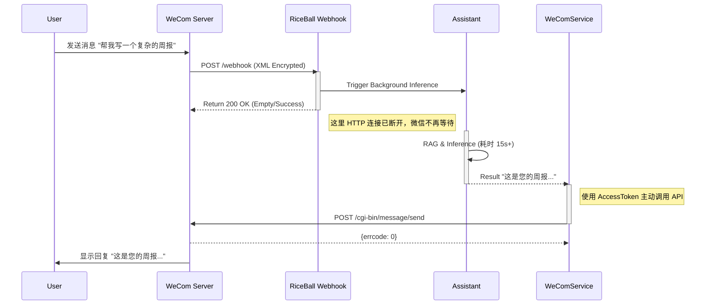
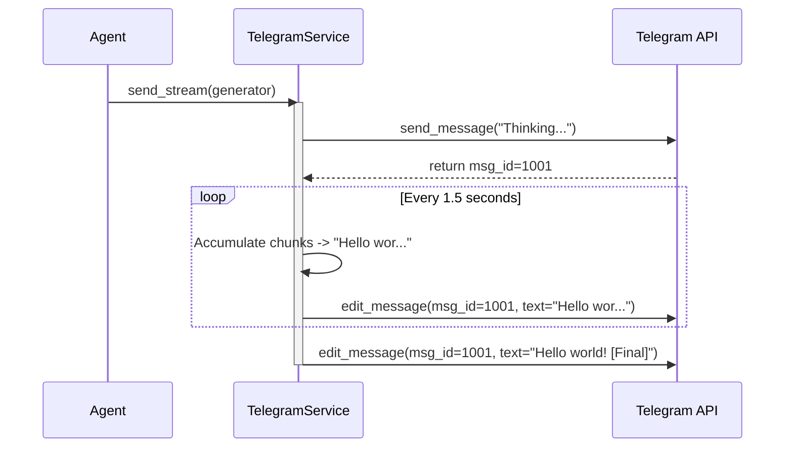
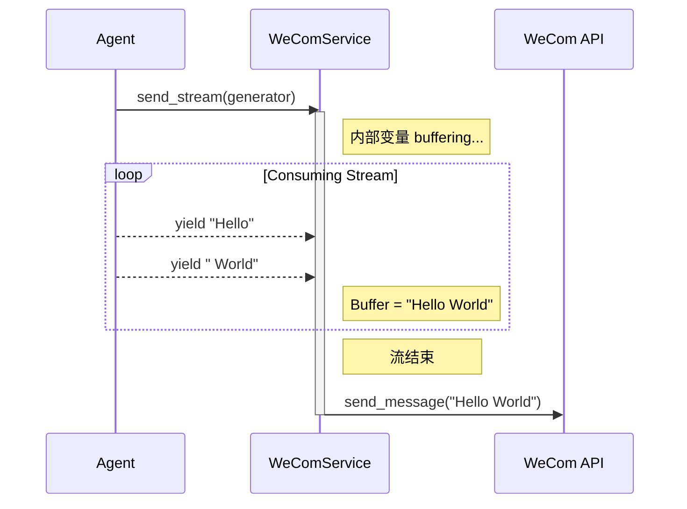

# 定时任务与主动推送架构方案

## 1. 核心概念关系图 (ERD & Class)

此图展示了新增的调度模块、重构后的通道服务以及它们与现有用户和助手模型的关系。



## 2. 逻辑架构分层

此图展示了引入 Scheduler 和解耦 Channel Service 后的分层架构。

```mermaid
graph TD
    subgraph "Trigger Sources (触发源)"
        Webhook[External Webhook] -->|Passive Event| API[API Interface]
        Timer[APScheduler] -->|Active Event| Executor[Task Executor]
    end

    subgraph "Core Logic (核心逻辑)"
        API -->|Invoke| AgentRuntime[Agent / Assistant Runtime]
        Executor -->|Invoke| AgentRuntime
        
        AgentRuntime -->|Get Response| ResponseHandler[Response Handler]
    end

    subgraph "Channel Layer (通道层 - 重构)"
        ResponseHandler -->|Push| BaseChannel[BaseChannelService]
        BaseChannel <|-- TG[TelegramService]
        BaseChannel <|-- Slack[SlackService]
        BaseChannel <|-- WeChat[WeChatService]
        
        TG -->|HTTP Request| TelegramAPI((Telegram API))
        Slack -->|HTTP Request| SlackAPI((Slack API))
    end

    subgraph "Data Storage"
        DB[(PostgreSQL)]
        DB -->|Load Task| Executor
        DB -->|Load Config| BaseChannel
    end
```

## 3. 定时任务执行时序图

展示当定时器触发时的完整执行流程。



## 4. 自动回复业务流程对比 (以 WeCom 为例)

本节展示针对 WeCom (企业微信) 的自动回复功能，在架构重构前后的运作差异。

### 4.1 调整前 (当前状态 - 同步响应)
目前的架构依赖于 HTTP 响应体直接返回结果 (Passive Response)。

**流程特点**：
1. **强耦合**: 接收逻辑与处理逻辑绑定在同一个 HTTP 请求生命周期内。
2. **超时风险**: 微信服务器要求 5 秒内响应，如果 RAG 或大模型推理慢，会导致超时报错。
3. **被动**: 只有收到消息才能回复，无法主动发起。



### 4.2 调整后 (目标状态 - 异步/主动推送)
将“接收”与“发送”分离，回复行为统一走 `ChannelService` (Active Push)。

**流程特点**：
1. **解耦**: Webhook 只负责收消息，并立即返回成功，避免超时。
2. **无超时限制**: 因为是后台异步处理，大模型可以思考 10秒甚至更久。
3. **逻辑复用**: “回复消息”走的路径与“定时任务推送”完全一致，都是调用 API 推送接口。



### 4.3 关键变更总结

| 维度 | 调整前 (Before) | 调整后 (After) |
| :--- | :--- | :--- |
| **通信模式** | 同步 (Sync Response) | 异步 (Async Push) |
| **响应时效** | 必须 < 5 秒 | 无限制 (用户体验更好) |
| **凭证需求** | 仅需 Token/EncodingAESKey (解密用) | **必须** CorpID + Secret (获取 AccessToken 主动调用 API 用) |
| **代码位置** | 逻辑在 API Router 中 | 逻辑在 Channel Service 中 |
| **适用场景** | 简单问答 | 复杂推理、定时任务、事件通知 |

## 5. 流式响应 (Streaming) 的适配策略

虽然 Assistant 内部是全链路流式 (Streaming) 的，但不同的 IM 平台对流式消息的支持能力截然不同。架构设计通过在 `ChannelService` 层实现差异化策略来解决这个问题。

### 5.1 抽象接口设计

在 `BaseChannelService` 中增加流式处理接口：

```python
class BaseChannelService(ABC):
    async def send_stream(self, target_id: str, stream_generator: AsyncIterator[str]):
        """
        处理流式内容。
        默认实现：将流聚合为完整字符串，调用 send_message (降级处理)。
        """
        full_content = []
        async for chunk in stream_generator:
            full_content.append(chunk)
        await self.send_message(target_id, "".join(full_content))
```

### 5.2 平台差异化实现

#### 场景 A: 伪流式 (Telegram, Slack)
这两个平台支持 **编辑 (Edit)** 已发送的消息。我们可以利用这个特性模拟流式效果。



#### 场景 B: 缓冲发送 (WeCom 企业微信)
WeCom 的普通应用消息 **不支持** 编辑已发送的文本，也不支持 HTTP 流式传输。因此只能采用 **"Accumulate & Send" (缓冲后发送)** 策略。

> **注意**: 虽然用户端看不到字一个个蹦出来，但因为架构是异步的，用户不再受 "5秒超时" 限制，这是比原先最大的改进。



### 5.3 总结

通过这种设计，业务逻辑层（Agent/Scheduler）不需要关心底层平台的限制，统一调用 `send_stream` 即可。

*   **如果接入的是 WeCom**: 用户会感觉到一阵等待，然后突然收到一条完整的长消息。
*   **如果接入的是 Telegram**: 用户会看到消息气泡已经在屏幕上，内容在不断刷新变长。

## 6. 异步技术实现细节

为了实现“立即响应 Webhook，后台慢慢处理”，我们在技术落地时采用以下机制：

### 6.1 Webhook 的异步处理 (Event Driven)

利用 FastAPI 原生的 `BackgroundTasks` 机制。

```python
# src/channels/api/webhook.py

@router.post("/webhook")
async def handle_webhook(
    payload: WebhookPayload, 
    background_tasks: BackgroundTasks,  # <--- FastAPI 注入
    db: AsyncSession = Depends(get_db)
):
    # 1. 快速校验签名
    verify_signature(payload)
    
    # 2. 挂载后台任务 (不阻塞当前 HTTP 返回)
    # 注意：这里不能直接传 db session，因为请求结束 session 会关闭
    # 需要传递 ID，在后台任务中重新创建 Session
    background_tasks.add_task(
        process_incoming_message, 
        channel_id=payload.channel_id,
        user_id=payload.user_id, 
        text=payload.text
    )
    
    # 3. 立即返回
    return Response(status_code=200)
```

### 6.2 统一执行器 (Executor)

无论是 **定时任务** (APScheduler) 还是 **即时消息** (BackgroundTasks)，最终都调用同一个执行函数，确保行为一致。

```python
# src/scheduler/executor.py

async def process_incoming_message(channel_id: UUID, user_id: str, text: str):
    """
    独立的异步上下文，自行管理资源生命周期
    """
    # 1. 创建新的数据库会话 (因为脱离了 Request 范围)
    async with async_session_maker() as session:
        # A. 恢复上下文 (找到对应的 Assistant 和 User)
        binding = await get_binding(session, channel_id, user_id)
        
        # B. 执行 AI 逻辑
        # 这里的 arun_stream 可能包含复杂的 RAG 检索
        response_gen = await assistant.arun_stream(text)
        
        # C. 获取通道服务并推送
        service = ChannelServiceFactory.get(binding.channel_type)
        await service.send_stream(binding.external_user_id, response_gen)
```

### 6.3 资源管理关键点

1.  **Session 生命周期**: 必须严格控制 `AsyncSession` 的创建与销毁。普通 Web 请求及其 `Depends` 注入的对象会在 Response 返回后失效，因此后台任务必须 **自己创建** 新的 Session。
2.  **异常捕获**: 后台任务报错不会在前端显示，必须在 `process_incoming_message` 内部做好 try/catch 并记录系统日志。

## 7. 前端配置流程变更 (UX/UI Redesign)

针对“渠道是否需要单独配置”的问题，架构调整带来了配置流程的重大变化。

### 7.1 核心原则：一次配置，到处使用 (Configure Once, Use Everywhere)

现在的“助手页面配渠道”模式导致了配置孤岛（例如：想让两个助手都用同一个 Telegram Bot 不方便）。
新的模式将渠道视为**独立资源**，需要单独管理，然后在助手中引用。

### 7.2 变更点 1: 新增“集成/通道管理”页面 (Integration Center)

**必须**在设置中新增一个独立的 **"通道管理 (Channels)"** 模块。

*   **功能**: 用户在这里输入 Telegram Bot Token、AppSecret 等敏感配置。
*   **动作**: 点击 "Add Channel" -> 选择类型 (Telegram/WeCom) -> 填写凭证 -> 保存。
*   **意义**: 这里只管“连接管道”，不管具体业务。

> **UI 示意**: 一个卡片列表，显示 "My Configured Bots"，包含状态指示灯（是否连通）。

### 7.3 变更点 2: 助手配置页面的简化 (Assistant Settings)

原有的助手配置页中的“集成配置”依然保留，但交互方式改变：

*   **移除**: 所有的输入框 (不再让用户在这里填 Token)。
*   **新增**: **勾选列表 (Channel Selector)**。
    *   系统列出所有已在“通道管理”中配置好的可用通道。
    *   用户只需打钩 `[x] My Telegram Bot`，即可将该助手挂载上去。

**保留该页面的理由**：
用户仍然需要决定**哪个助手接管哪个 Bot**。例如，我可能有 "客服Bot" 和 "运维Bot" 两个通道，我需要在助手 A 的配置里勾选 "客服Bot"，在助手 B 的配置里勾选 "运维Bot"。

### 7.4 变更点 3: 定时任务配置 (Scheduled Tasks)

这是一个全新的页面/抽屉。

1.  **选择执行者**: 下拉选择助手 (Assistant)。
2.  **设定指令**: 输入 Prompt (e.g., "总结昨天的报错日志")。
3.  **设置时间**: 选择频率 (e.g., 每天 08:00)。
4.  **选择接收者 (Target)**:
    *   下拉框列出 **"我的已绑定会话"**。
    *   例如选择: `Telegram (User: Rafi)` 或 `WeCom (Chat: DevGroup)`。
    *   *注：这里选择的是具体的“人”或“群”，不仅仅是 Bot。系统会自动根据 binding 关系找到对应的 ChannelConfig 进行推送。*
