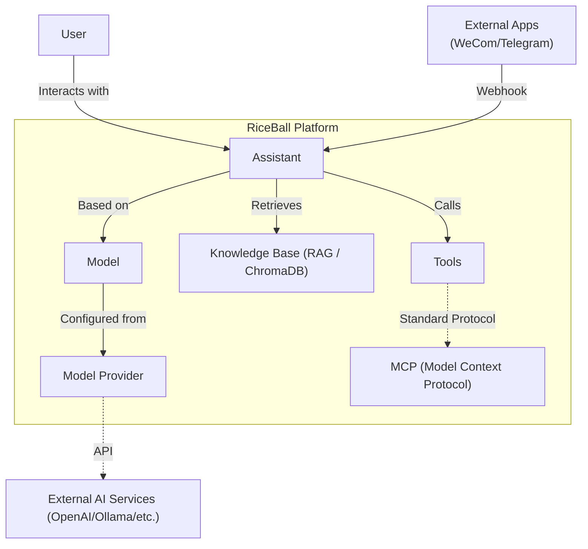

# Architecture Overview

RiceBall is not just a tech stack, but a comprehensive **AI Agent & Knowledge Base Platform**.

## Core Concepts

The diagram below shows the relationships between the core entities in the RiceBall system:

### Entity Explanation

- **Assistant**: The core entity for user interaction. It defines "Who am I" (System Prompt), "What brain do I use" (Model), "What do I remember" (Knowledge Base), and "What can I do" (Tools).
- **Channels**: The interface for external communication.
  - **Adapter Pattern**: Normalized handling of messages from different platforms (WeCom, Telegram, etc.).
  - **Identity Mapping**: Automatically maps external user IDs (e.g., WeCom UserID) to internal system users, ensuring conversation isolation.
- **Model Provider & Model**: 
  - **Provider**: Manages credentials for AI service providers (e.g., OpenAI API Key).
  - **Model**: Specific model configuration (e.g., GPT-4o). RiceBall abstracts away the differences between providers.
- **RAG (Knowledge Base)**: Vector storage based on **ChromaDB**. Allows users to upload documents, and the Assistant automatically retrieves relevant snippets when answering, enabling "open-book exams".
- **Tools & MCP**: 
  - **Tools**: Functional capabilities that the Assistant can call.
  - **MCP**: Uses the Model Context Protocol to standardize the integration of tools and context, making it very easy to extend Assistant capabilities.

## Technical Architecture

RiceBall adopts a modern separated frontend and backend architecture.

## Backend

- **Framework**: FastAPI
- **Database**: Async SQLAlchemy + PostgreSQL (or other supported databases)
- **AI Orchestration**: LangChain
- **Protocol**: Model Context Protocol (MCP)

## Frontend

- **Framework**: Nuxt 3 (Vue 3)
- **UI Library**: Tailwind CSS + Shadcn Vue
- **State Management**: Pinia

## Directory Structure

- `backend/`: Python backend code
- `frontend/`: Vue/Nuxt frontend code
- `src/`: Backend core logic modules
