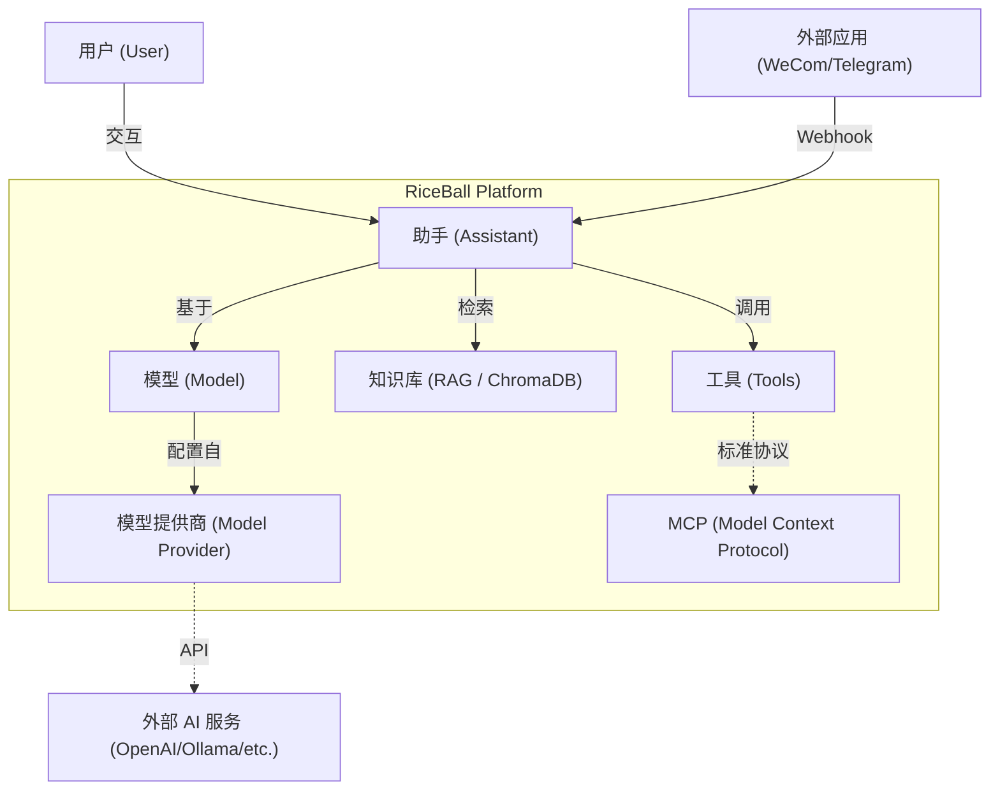

# 架构概览

RiceBall 不仅是一个技术堆栈，更是一个功能完备的 **AI 智能体 (Agent) 与知识库平台**。

## 核心概念 (Core Concepts)

下图展示了 RiceBall 系统中各个核心实体之间的关系：

### 实体说明

- **Assistant (助手)**: 用户交互的核心实体。它定义了"我是谁"（系统提示词）、"我能用什么大脑"（模型）、"我记得什么"（知识库）以及"我能做什么"（工具）。
- **Channels (渠道)**: 外部沟通的接口。
  - **适配器模式 (Adapter Pattern)**: 统一处理来自不同平台（企业微信、Telegram 等）的消息。
  - **身份映射 (Identity Mapping)**: 自动将外部用户 ID（如企业微信 UserID）映射为系统内部用户，确保对话隔离。
- **Model Provider & Model**: 
  - **Provider**: 管理 AI 服务商的凭证（如 OpenAI API Key）。
  - **Model**: 具体的模型配置（如 GPT-4o）。RiceBall 屏蔽了不同提供商的差异。
- **RAG (知识库)**: 基于 **ChromaDB** 的向量存储。
  - **检索 (Retrieval)**: 允许用户上传文档，助手在回答时会自动检索相关片段，实现"带书应考"。
  - **记忆与回写 (Write-Back)**: 一项独特功能，允许助手将信息*写回*知识库，实现长期记忆形成和自动笔记。
- **Tools & MCP**: 
  - **Tools**: 助手可调用的功能函数。
  - **MCP**: 采用 Model Context Protocol 协议，实现了工具和上下文的标准化接入，使得扩展助手能力变得非常容易。

## 技术架构 (Technical Architecture)

RiceBall 采用现代化的前后端分离架构。

## 后端 (Backend)

- **框架**: FastAPI
- **数据库**: Async SQLAlchemy + PostgreSQL (或其他支持的数据库)
- **AI 编排**: LangChain
- **协议**: Model Context Protocol (MCP)

## 前端 (Frontend)

- **框架**: Nuxt 3 (Vue 3)
- **UI 库**: Tailwind CSS + Shadcn Vue
- **状态管理**: Pinia

## 目录结构

- `backend/`: Python 后端代码
- `frontend/`: Vue/Nuxt 前端代码
- `src/`: 后端核心逻辑模块
